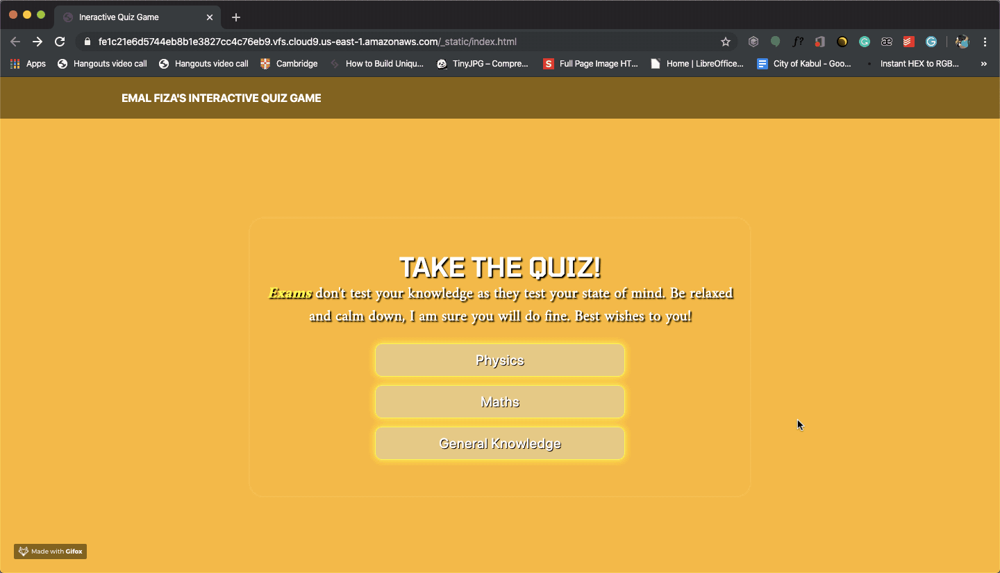
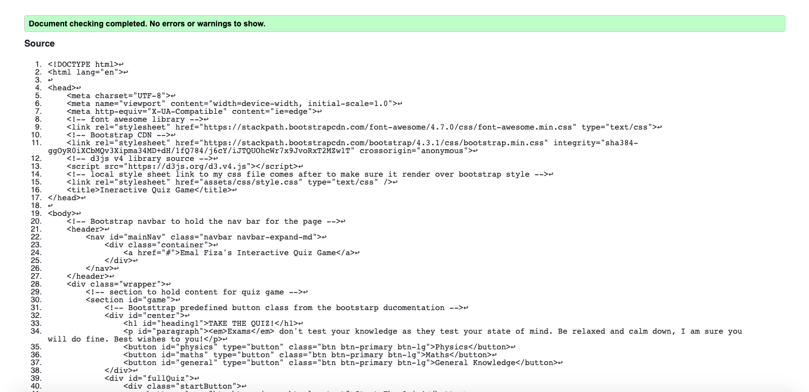
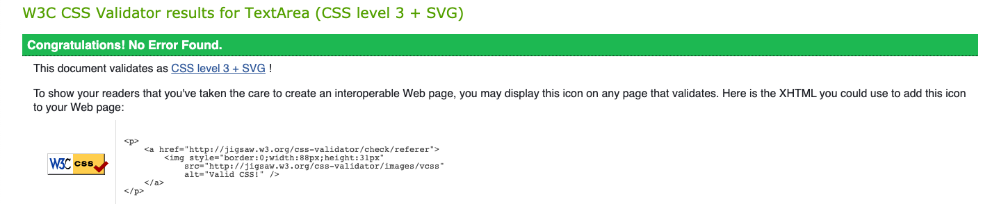

# Emal Fiza's Interactive Quiz Game

-----

Interactive Frontend Development - Code Institute

Interactive Quiz Game: 

I always wonder if teachers think to themselves, “How much do my students already know about this topic” before they begin teaching a particular topic to their students.

I hope they really do for the simple reason that it will help them shape their teaching strategy. And, an effortless way to understand this, is assigning your students an online interactive quiz.

Interactive quizzes ask a series of interactive questions to the users that assess how much they know on a particular topic. Assigning interactive quizzes is much more fun and exciting way for your students to engage in the classroom, and plays to their curiosity.

An interactive quiz is a knowledge test centered around a particular topic. An interactive quiz aims to not only measure knowledge levels but also to initiate conversation and enable equal exchange of information.

The answers come with instant feedback and remarks that are valuable. They are interesting as the quiz takers don’t have to wait for the results to arrive or tally up their points like a paper-based test.

Emal Fiza's Interactive Quiz Game is consists of 3 subjects: 
1. Physics
2. Maths 
3. General Knowledge

Each subject contains 10 intermediate questions along with 4 options which is only one correct among them. Once a user finishes answering 10 questions, a piechart will pop up presenting the user the stats of his/her correct and incorrect answers.

# Demo

----

A live demo of the entire pages 

[Link to deployed website](https://emalfiza.github.io/interactive-quiz-game/)

# UX

-----

My goal in the design was to create a simple and clear quiz game website to be both informative and freindly enabling the user and easy access to the quiz game content on the site whilst aiming for a minimalist design.
For users, I wanted to provide them with an intermidiate level of knowledge about physics, maths and general knowledge overview of Kabul and its culture via a simple, friendly and interactive design.

### User Stories

* As the website developer I want to build a game website which allows users to feel comfortable visiting the page and to learn or refresh thier knowledge through interactiveity.
* As the website developer I want the content of the page to be presented in a user friendly and traditionally way to showcase the simplicity and beauty of technologies.
* As the website developer I want to create a website which is subtle and visually appealing and pleasing with the very basics of software developing programming html, css and javascript.

# Technologies

------

- [AWS Cloud9](https://aws.amazon.com/cloud9/)
- [HTML](https://www.wikipedia.com/HTML)
- [CSS](https://en.wikipedia.org/wiki/Cascading_Style_Sheets)
- [JavaScript](https://www.javascript.com/)
- [Bootstap 4](https://getbootstrap.com/) 
- [Google Fonts](https://fonts.google.com/)
- [jQuery](https://jquery.com/)
- [Popper.js](https://cdnjs.com/#)
- [Font Awesome](https://fontawesome.com/)
- [d3.js v4](https://d3js.org/)

# Features

---

* A single scrolable page with colour change background.

* A Bootstrap 4 navbar background colour transparent promote a minimalist and eye friendly design.

* An eye catching and infinite changing colour div at the heart of the page to showcase the quiz game glooming subject buttons, h1 and a freindly paragraph.

* A container-fluid class footer background colour transparent containing the social media icions to promote a rich contarst of colouring.

* An eye catching and infinite changing colour div presenting the quiz game questions and options which reshape and response to all the screen sizes. 

* A d3.js v4 piechart to manifest the stats of the users performance.

# Testing

----

The Overall idea of the website was created by myself. 

This site was tested across multiple browsers (Chrome, Safari, Internet Explorer, FireFox and Opera) and on multiple mobile devices (GalaxyS5, Pixel 2, Pixel 2XL, iPhone 5/SE, iPhone 6/7/8, iPhone 6/7/8plus iPhone X, iPod, IPod Pro, MacBook Air and Desktop) to ensure compatibility and responsiveness.

HTML codes were tested in w3c html validator. 

CSS3 codes were tested in w3c css validator. 

# Deployment

----
### Deployment onto GitHub

1. `git init`

2. `git add file name`

3. `git commit -m "comment"`

4. `orgin master copied from the github pages`

5. `git push orgin master`

6. `git status`

7. `github username entered`

8. `github password entered`

Under my repository name, I clicked Settings. I scrolled down to the GitHub Pages section and used the Select source drop-down menu to select 'master' as my GitHub Pages publishing source.

This site is hosted using GitHub pages, deployed directly from the master branch. The deployed site will update automatically upon new commits to the master branch. In order for the site to deploy correctly on GitHub pages, the landing page must be named `index.html`.

To run locally, you can clone this repository directly into the editor of your choice by pasting `git clone` into your terminal. To cut ties with this GitHub repository, type`git remote rm origin` into the terminal.

### Credits

-----

### Author

Emal Fiza : Student of Code Institue 

### Content

The questions for all the 3 subjects are initiated written by Aamina Bhutta ( Leicester University Physics Student) content on the "Landing Page" is written by me.

### Acknowledgements
The Bootstrap 4 navbar classes and the btn-primary buttons class were taken from [getbootstrap](https://startbootstrap.com/snippets/full-image-background/)
The Javascript game logic codes were taken and overwritten from [codepen](https://codepen.io/kwikimart/pen/VjQQNK)
The piechart codes were taken and overwritten from [codepen.io](https://codepen.io/zakariachowdhury/pen/OWdyjq?editors=0110)

1.Housam Ziad guided and instructed me.

2.irfanrizvidev helped me with JavaScript and piechart

3.Aamina Bhutta helped me with the subjects questions

**This is for educational**
